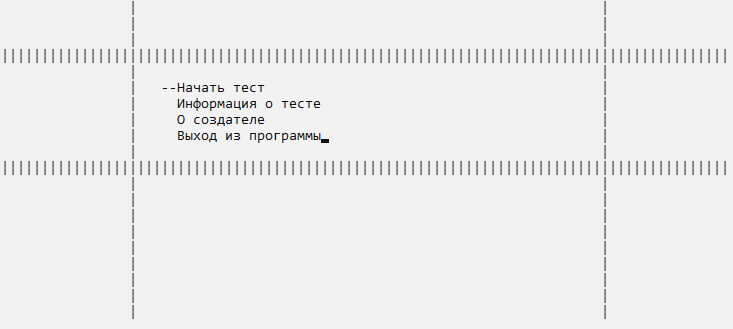
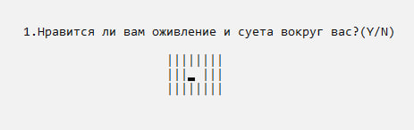
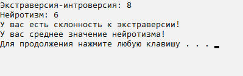

# psytest
Программа на языке C++ для проведения психологического теста.

## Описание
Пользователь отвечает на 25 вопросов, чтобы определить свой тип личности (экстраверт, интроверт и т.д.). 

## Особенности
- Меню с пунктами:
  1. Начать тест.
  2. Узнать информацию о тесте.
  3. О создателе.
  4. Выход.
- Автоматический анализ ответов.
- Вывод результатов с описанием личности.

## Требования
- **Операционная система:** Windows 10
- **Среда разработки:** Visual Studio 2019
- **Язык программирования:** C++ (с библиотекой `Windows.h`)

## Как запустить
1. Скачайте исходный код из репозитория.
2. Откройте проект в Visual Studio 2019.
3. Соберите проект и запустите программу.

## Пример использования
### Меню программы

### Вопросы

### Результат

