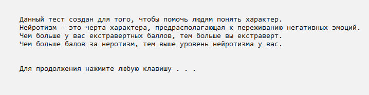
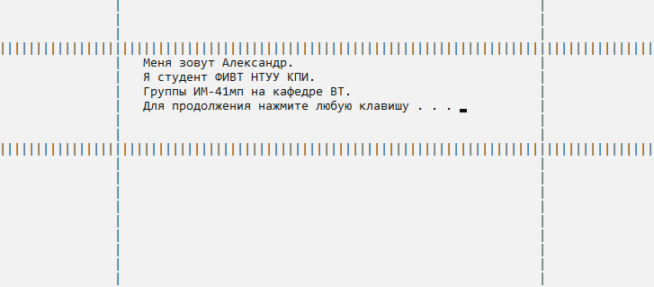

# psytest
Програма мовою C++ для проведення психологічного тесту.

## Опис
Користувач відповідає на 25 запитань, щоб визначити свій тип особистості (екстраверт, інтроверт тощо).

## Особливості
- Меню з пунктами:
  1. Почати тест.
  2. Дізнатися інформацію про тест.
  3. Про автора.
  4. Выход.
- Автоматичний аналіз відповідей.
- Вивід результатів з описом особистості.

## Інфраструктура
- **Операційна система:** Windows 10
- **Середовище розробки:** Visual Studio 2019
- **Мова програмування:** C++ (з бібліотекою `Windows.h`)

## Як запустити
1. Завантажте вихідний код із репозиторію.
2. Відкрийте проект в Visual Studio 2019.
3. Зберіть проект та запустіть програму.

## Приклад використання
### Меню програми

### Інформація про тест

### Про автора

### Питання

### Результат

